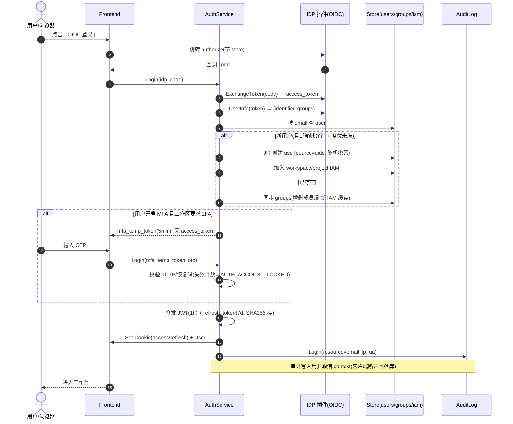
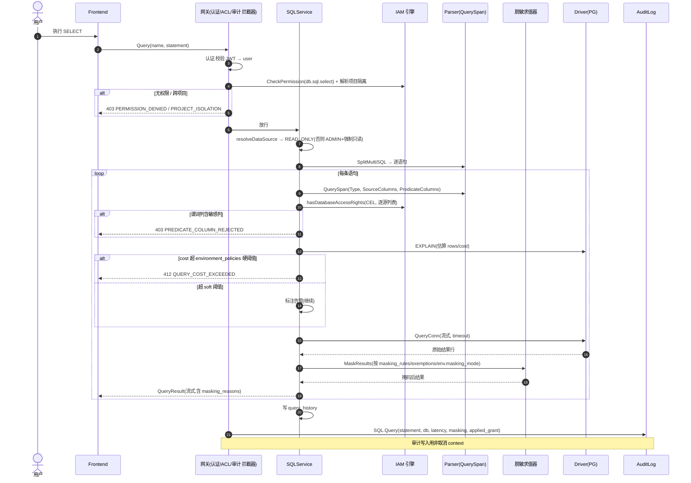

# 13 — 核心时序图

> 4 条最关键端到端流程的工程级时序,含成功路径、分支与失败处理。配合 [12 API 契约](./12-api-contract.md) 与 [10 数据模型](./10-data-model.md) 阅读。图用 Mermaid 描述。

---

## 1. 登录(OIDC + MFA + JIT 开户)

覆盖 [05](./05-auth-idp.md)。要点:SSO 回调 → 取 UserInfo → 用户匹配/创建(JIT)→ 组同步 → MFA 判定 → 发 token → 审计。



**失败分支:** 凭据错误 `AUTH_INVALID_CREDENTIALS`;邮箱域不允许/席位满 `PERMISSION_DENIED`;MFA 码错 `AUTH_MFA_INVALID`(超限锁定)。

---

## 2. 查询执行(端到端安全管线)

覆盖 [03](./03-sql-query.md)、[02](./02-permission-and-access.md)。这是系统最复杂的链路:**粗权限 → 项目隔离 → QuerySpan → 细权限(CEL)+ 谓词列 → 成本护栏 → 执行 → 脱敏 → 审计 → 流式返回**。



**关键失败码:** `PERMISSION_DENIED` / `PROJECT_ISOLATION` / `PREDICATE_COLUMN_REJECTED` / `QUERY_COST_EXCEEDED` / `QUERY_TIMEOUT` / `NON_READONLY_STATEMENT` / `DB_CONNECTION_FAILED`(`UNAVAILABLE`)。

**JIT 命中(可选):** Query 入口 `preCheckAccess` 先查调用者 ACTIVE 的 `access_grants`(target=db、未过期、语句匹配);命中则 `SkipMasking`(若 unmask=true),结果带 `applied_access_grant`。

---

## 3. 异步导出生命周期

覆盖 [04](./04-data-export.md)、[10 notifications](./10-data-model.md)。要点:同步导出被阈值拦截 → 建任务 → 后台流式跑 + 脱敏 + 存产物 → 通知 → 下载 → 过期清理。

```mermaid
sequenceDiagram
    autonumber
    actor U as 用户
    participant F as Frontend
    participant E as ExportTaskService
    participant R as Task Runner
    participant D as Driver(PG)
    participant ST as Storage(本地/S3 抽象)
    participant N as Notification
    participant AU as AuditLog

    U->>F: 导出(大 SQL)
    F->>E: 先试 Export(同步)
    E->>D: EXPLAIN 估算行数
    alt 预估 > 1 万行(D22)
        E-->>F: 412 EXPORT_TOO_LARGE_FOR_SYNC
    end
    F->>E: CreateExportTask(parent=project, task, request_id)
    E->>E: 权限/脱敏校验(同查询);幂等(request_id)
    E->>AU: CreateExportTask
    E->>R: 入队(state=CREATED)
    E-->>F: ExportTask(state=CREATED)

    R->>R: 取任务 → state=RUNNING
    R->>D: QueryConn(流式, 超时)
    loop 流式分批
        D-->>R: 行数据
        R->>R: 按格式流式写入(CSV/JSON/SQL/XLSX)
        R->>R: 脱敏(除非审批/JIT 去脱敏)
    end
    alt 成功
        R->>ST: 写密码 ZIP(export_archive, expires_at=now+24h)
        R->>R: state=SUCCEEDED(row_count, size)
        R->>N: export_done → 发起人
    else 失败
        R->>R: state=FAILED(error)
    end

    U->>F: 列表/收到通知
    U->>E: DownloadExport(name, password)
    E->>E: 校验归属 + ZIP 密码
    alt 已过期
        E-->>F: 404 EXPORT_ARCHIVE_EXPIRED
    end
    E->>AU: DownloadExport
    E-->>U: 流式 ZIP

    Note over R,ST: 清理器周期:删除 expires_at<now 的 archive → task.state=EXPIRED
```

**要点:** 产物经存储抽象(D20);MVP 本地盘;通知走站内(D21);行数/格式按环境策略。

---

## 4. JIT 临时访问(申请→审批→生效→过期)

覆盖 [02 §6](./02-permission-and-access.md)、[10 access_grants](./10-data-model.md)。要点:申请→通知审批人→激活→期间查询去脱敏且强审计→到期失效。

```mermaid
sequenceDiagram
    autonumber
    actor App as 申请人
    actor Apv as 审批人(securityAdmin/projectOwner)
    participant F as Frontend
    participant G as AccessGrantService
    participant N as Notification
    participant Q as SQLService
    participant AU as AuditLog

    App->>F: 发起 JIT(库, unmask=true, reason, expire=30min)
    F->>G: CreateAccessGrant
    G->>G: state=PENDING
    G->>AU: CreateAccessGrant
    G->>N: jit_pending → 审批人

    Apv->>F: 审批(批准)
    F->>G: ActivateAccessGrant
    G->>G: state=ACTIVE(approved_by/time)
    G->>AU: ActivateAccessGrant
    G->>N: jit_resolved → 申请人

    Note over App,Q: 有效期内:申请人查该库
    App->>Q: Query(目标库, statement)
    Q->>Q: preCheckAccess: 命中 ACTIVE grant(target=db, 未过期, 语句匹配)
    Q->>Q: selectBestAccessGrant(unmask 优先); SkipMasking=true
    Q->>Q: 执行 → 返回**明文**结果(applied_access_grant=grant)
    Q->>AU: SQL.Query(标记 applied_access_grant)
    Note over Q,AU: JIT 下查询可按 applied_access_grant 专项复查

    Note over G: 到期(expire_time)或手动 Revoke → state=EXPIRED/REVOKED
    G-->>App: 后续查询恢复脱敏
```

**要点:** grant 的目标库仍受跨库 IAM 检查(防借 JIT 越权读别的库);所有 JIT 下查询在审计中可按 `applied_access_grant` 专项复查。

---

## 5. 流程与决策/文档映射

| 流程 | 关键决策/依据 |
|---|---|
| 登录 | OIDC/LDAP(D4 待补引擎无关)、MFA、JIT 开户、共享账号(D2 不影响登录) |
| 查询 | 项目隔离(D15/D16)、环境护栏(D17/D8)、谓词列、脱敏、字面量审计(D5) |
| 导出 | 强制异步阈值(D22)、存储抽象(D20)、站内通知(D21)、产物 24h |
| JIT | 临时去脱敏、审批通知、强审计(D5) |
