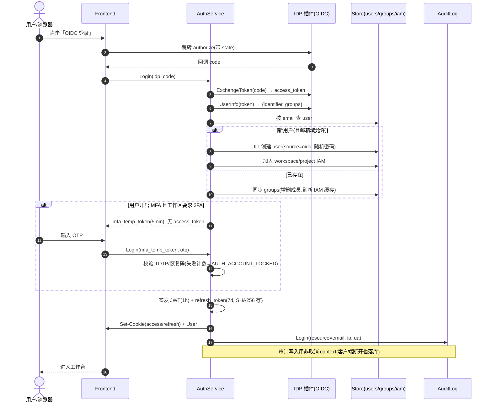
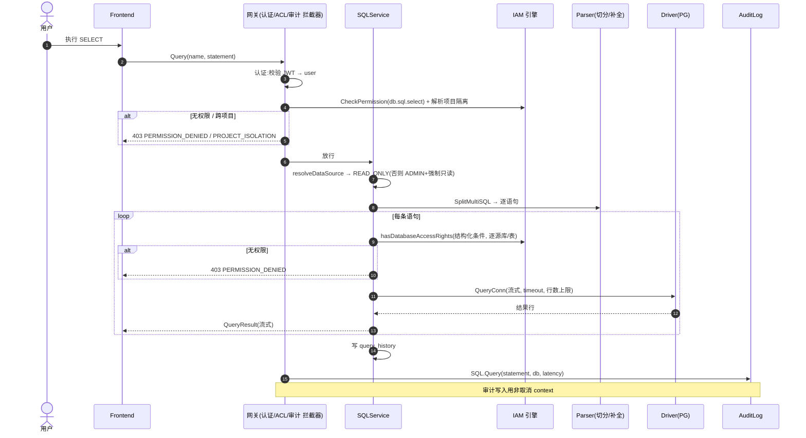

# 13 — 核心时序图

> 4 条最关键端到端流程的工程级时序,含成功路径、分支与失败处理。配合 [12 API 契约](./12-api-contract.md) 与 [10 数据模型](./10-data-model.md) 阅读。图用 Mermaid 描述。

---

## 1. 登录(OIDC + MFA + JIT 开户)

覆盖 [05](./05-auth-idp.md)。要点:SSO 回调 → 取 UserInfo → 用户匹配/创建(JIT)→ 组同步 → MFA 判定 → 发 token → 审计。



**失败分支:** 凭据错误 `AUTH_INVALID_CREDENTIALS`;邮箱域不允许 `PERMISSION_DENIED`;MFA 码错 `AUTH_MFA_INVALID`(超限锁定)。

---

## 2. 查询执行(端到端安全管线)

覆盖 [03](./03-sql-query.md)、[02](./02-permission-and-access.md)。链路:**粗权限 → 项目隔离 → 细权限(结构化条件,库/表/环境) → 行数/超时上限 → 执行 → 审计 → 流式返回**。



**关键失败码:** `PERMISSION_DENIED` / `PROJECT_ISOLATION` / `QUERY_ROW_LIMIT_EXCEEDED` / `QUERY_TIMEOUT` / `NON_READONLY_STATEMENT` / `DB_CONNECTION_FAILED`(`UNAVAILABLE`)。

> v1 不做脱敏/谓词列保护/成本护栏/平台侧 JIT（路线图见 [18](./18-roadmap.md)）。敏感列可见性由数据库授权决定，平台对全部查询审计。

---

## 3. 异步导出生命周期

覆盖 [04](./04-data-export.md)、[10 notifications](./10-data-model.md)。要点:同步导出被阈值拦截 → 建任务 → 后台流式跑 + 存产物 → 通知 → 下载 → 过期清理。

```mermaid
sequenceDiagram
    autonumber
    actor U as 用户
    participant F as Frontend
    participant E as ExportTaskService
    participant R as Task Runner
    participant D as Driver(PG)
    participant ST as Storage(本地/S3 抽象)
    participant N as Notification
    participant AU as AuditLog

    U->>F: 导出(大 SQL)
    F->>E: 先试 Export(同步)
    E->>D: EXPLAIN 估算行数
    alt 预估 > 1 万行(D22)
        E-->>F: 412 EXPORT_TOO_LARGE_FOR_SYNC
    end
    F->>E: CreateExportTask(parent=project, task, request_id)
    E->>E: 权限校验(同查询);幂等(request_id)
    E->>AU: CreateExportTask
    E->>R: 入队(state=CREATED)
    E-->>F: ExportTask(state=CREATED)

    R->>R: 取任务 → state=RUNNING
    R->>D: QueryConn(流式, 超时)
    loop 流式分批
        D-->>R: 行数据
        R->>R: 按格式流式写入(CSV/JSON)
    end
    alt 成功
        R->>ST: 写密码 ZIP(export_archive, expires_at=now+24h)
        R->>R: state=SUCCEEDED(row_count, size)
        R->>N: export_done → 发起人
    else 失败
        R->>R: state=FAILED(error)
    end

    U->>F: 列表/收到通知
    U->>E: DownloadExport(name, password)
    E->>E: 校验归属 + ZIP 密码
    alt 已过期
        E-->>F: 404 EXPORT_ARCHIVE_EXPIRED
    end
    E->>AU: DownloadExport
    E-->>U: 流式 ZIP

    Note over R,ST: 清理器周期:删除 expires_at<now 的 archive → task.state=EXPIRED
```

**要点:** 产物经存储抽象(D20);MVP 本地盘;通知走站内(D21);行数/格式按环境策略。

---

## 4. JIT 临时访问 —— 不在 v1 范围

> v1 不实现平台侧 JIT（路线图见 [18 §1.2](./18-roadmap.md)）。临时放行由 DBA 在数据库侧调整授权 + 全量审计实现。

---

## 5. 流程与决策/文档映射

| 流程 | 关键决策/依据 |
|---|---|
| 登录 | OIDC/LDAP、MFA、JIT 开户、共享账号(D2 不影响登录) |
| 查询 | 项目隔离(D15/D16)、环境护栏(D17)、行数/超时上限、字面量审计(D5) |
| 导出 | 强制异步阈值(D22)、存储抽象(D20)、站内通知(D21)、产物 24h |
| JIT | 延后 v2（随脱敏） |
